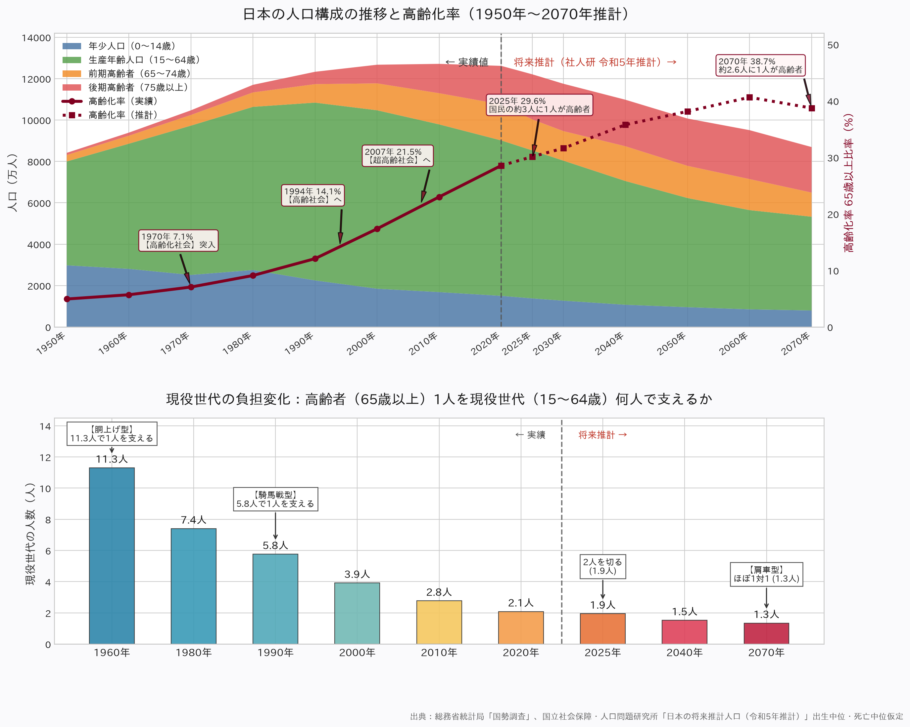

# 日本の高齢化と人口推移のデータ可視化 (1950〜2070)

日本の人口構造の長期推移、高齢化率の変動、および現役世代の扶養負担構造（胴上げ型から騎馬戦型、肩車型へ）を可視化したダッシュボードです。

> **Note**  
> 本サイトおよび可視化スクリプトは、コーディングエージェントハーネス [**pi**](https://github.com/earendil-works/pi-coding-agent) をハーネスに、モデルは **Gemini 3.8 Flash** を使って作成・検証・公開されました。（総APIコスト: **$0.878**）

## 📊 可視化グラフ



## 🌐 公開サイト (GitHub Pages)

本リポジトリは GitHub Pages で公開されています：  
👉 **[https://katzkawai.org/kklab-pi/](https://katzkawai.org/kklab-pi/)** (または [https://katzkawai.github.io/kklab-pi/](https://katzkawai.github.io/kklab-pi/))

## 🚀 実行方法 (PEP 723 / uv)

本スクリプトは [PEP 723](https://peps.python.org/pep-0723/) (Inline script metadata) に準拠しており、[`uv`](https://github.com/astral-sh/uv) を使用して依存関係を即座に自動解決して実行できます。

```bash
uv run visualize_aging_japan.py
```

### 依存関係
- Python `>=3.11, <3.12`
- `pandas`
- `matplotlib`
- `japanize-matplotlib`

## 📚 出典
- 総務省統計局「国勢調査」（1950年〜2020年 実績値）
- 国立社会保障・人口問題研究所「日本の将来推計人口（令和5年推計）出生中位・死亡中位仮定」（2025年〜2070年 推計値）
